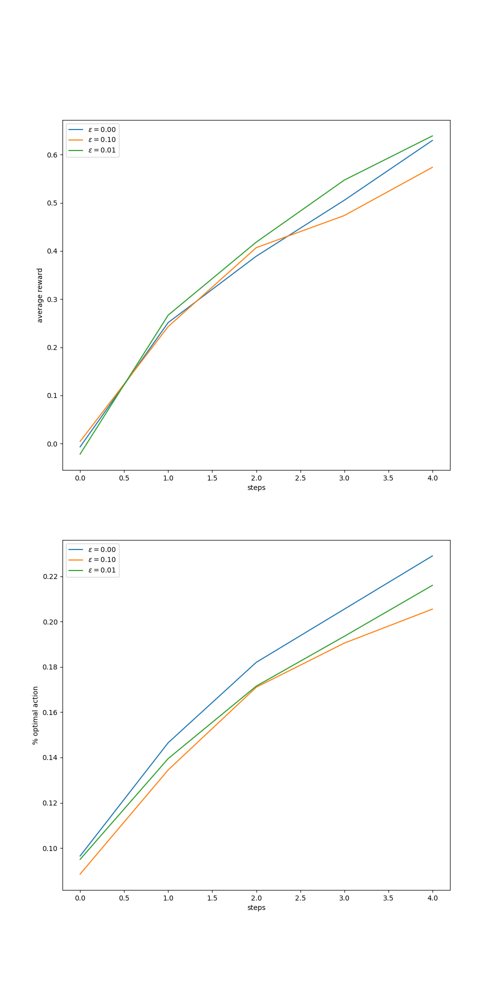
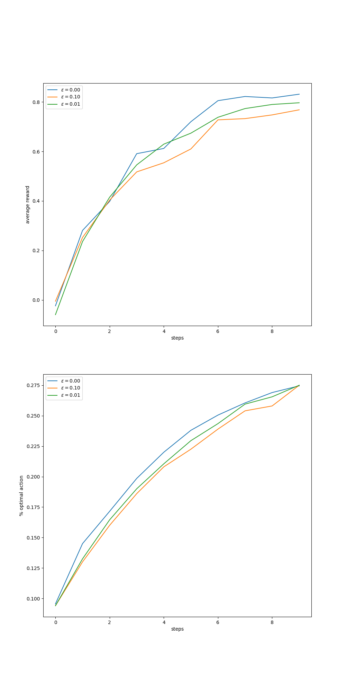
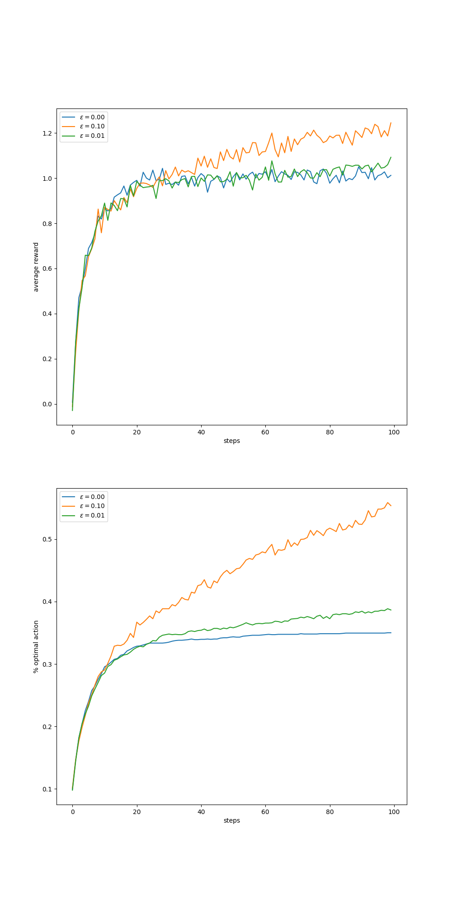
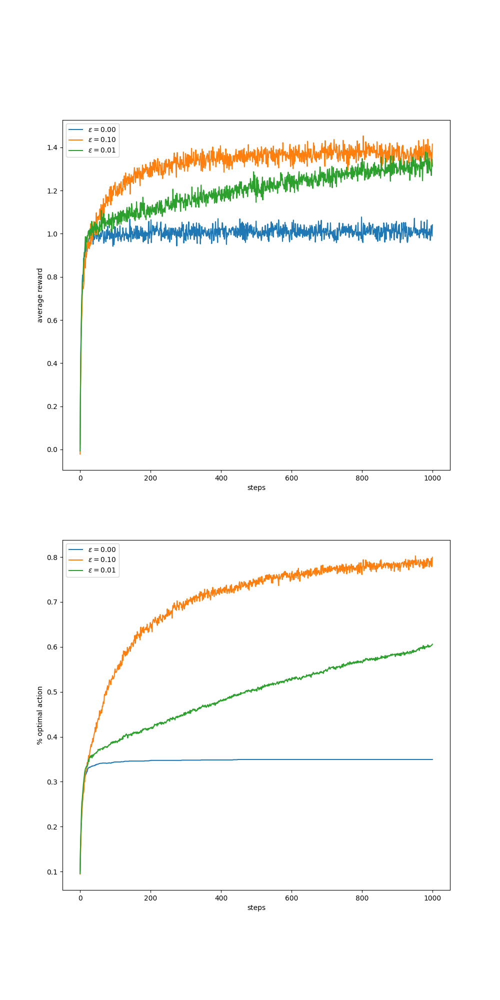

修改函数[figure_2_2()](https://github.com/jyellow/reinforcement-learning-an-introduction/blob/master/chapter02/ten_armed_testbed.py#L240)的参数tine, 分别取[5, 10, 100, 1000], 能够得到单次实验分别取[5, 10, 100, 1000]次后的平均review
```python
figure_2_2(runs=2000, time=5)
figure_2_2(runs=2000, time=10)
figure_2_2(runs=2000, time=100)
figure_2_2(runs=2000, time=1000)
```
得到如下图所示的四个结果:
1. time=5实验结果
    - 

2. time=10实验结果
    - 

3. time=100实验结果
    - 

4. time=1000实验结果
    - 